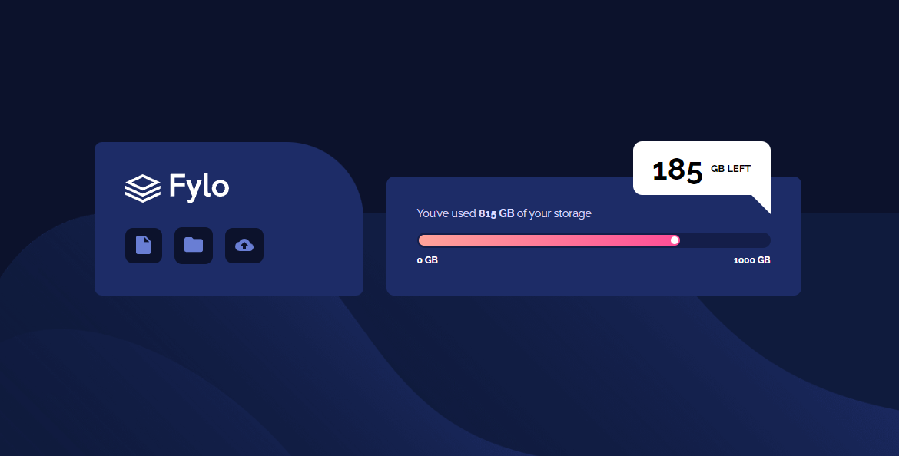
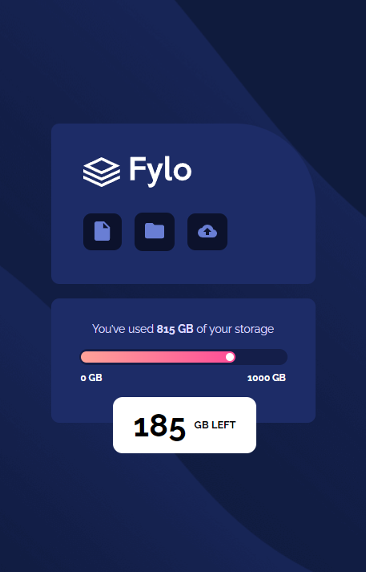

# Desafio Frontend Mentor - Solução do Fylo data storage component

Esta é uma solução para o [Desafio Fylo data storage component no Frontend Mentor](https://www.frontendmentor.io/challenges/fylo-data-storage-component-1dZPRbV5n).

## Índice

- [Visão geral](#visão-geral)
  - [Desafio](#desafio)
  - [Screenshot](#screenshot)
  - [Links](#links)
- [Meu processo](#meu-processo)
  - [Tecnologias utilizadas](#tecnologias-utilizadas)
  - [Desenvolvimento](#desenvolvimento)
- [Autor](#autor)
- [Agradecimentos](#agradecimentos)

## Visão geral

### Desafio

Os usuários devem ser capazes de:

- criar o layout ideal para a página, dependendo do tamanho da tela do dispositivo

### Screenshot

#### Desktop

#### Mobile

### Links

- Solução do desafio no frontend mentor: [Fylo data storage component - Frontend mentor](https://www.frontendmentor.io/solutions/fylo-data-storage-component-dSFKZpDMLK)
- URL da página: [Fylo data storage component](https://alexjr53.github.io/fylo-data-storage-component/) 
- Repositório do projeto no GitHub: [Fylo data storage component](https://github.com/Alexjr53/fylo-data-storage-component)

## Meu processo

### Tecnologias utilizadas

- HTML
- CSS

### Desenvolvimento

Atualmente estou usando desafios do frontend mentor apenas para praticar, aprimorando assim meus conhecimentos de HTML e CSS, para que no futuro possa aprimorar este e outros projetos também feitos a partir do frontend mentor.

## Autor
Alexsandro rosa junior

- GitHub - [Alexjr53](https://github.com/Alexjr53)
- Frontend Mentor - [@Alexjr53](https://www.frontendmentor.io/profile/Alexjr53)

## Agradecimentos
Agradecimentos a equipe [Dev em Dobro](https://www.instagram.com/devemdobro/) que está me passando o conhecimento e conceitos necessários para poder realizar esses desafios.
